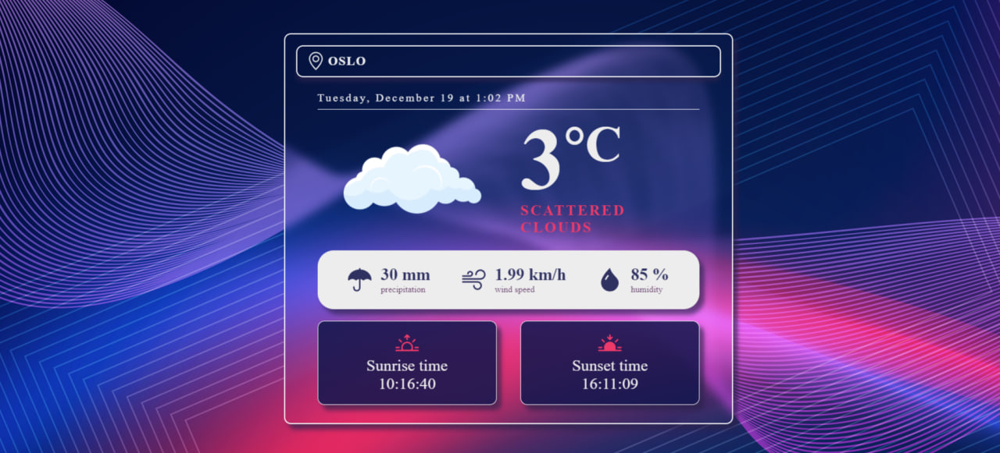

# Weather App
This is a simple weather app.

## Technologies Used
+ **Vite**: The project was scaffolded using Vite, providing a fast and efficient development environment.
+ **React + TypeScript**: The app is built on the React framework using TypeScript for enhanced type checking.
+ **Redux**: State management is handled using Redux for a centralized and predictable state container.
+ **OpenWeatherAPI**: The app fetches weather data from the OpenWeatherAPI to provide accurate and reliable information.
+ **SCSS**: Styling is done using SCSS to keep styles modular and maintainable.

## Installation
 Clone the repository: ```git clone https://github.com/sandrvvu/WeatherNow.git```\
 Install dependencies: 
 ```
cd WeatherNow
npm install
```
Run the development server: ```npm run dev```

### Note 
You should create .env file in the project root and add:
```VITE_OPENWEATHERMAP_API_KEY=your_api_key```\
Replace your_api_key with your OpenWeather API key (we use this api key in the weatherSlice.ts).

## Screenshots

+ City Search


+ Weather Data


+ Loading


+ Error


# Happy coding and stay weather-ready!ꨄꨄꨄ
